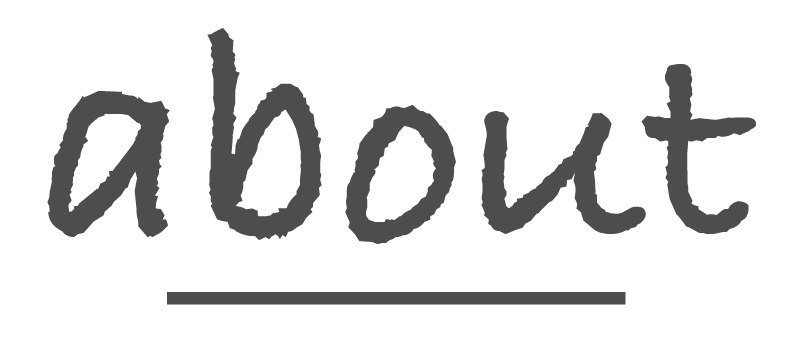
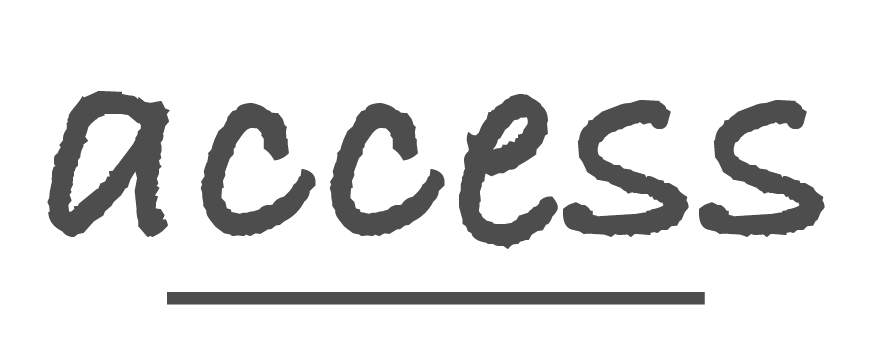
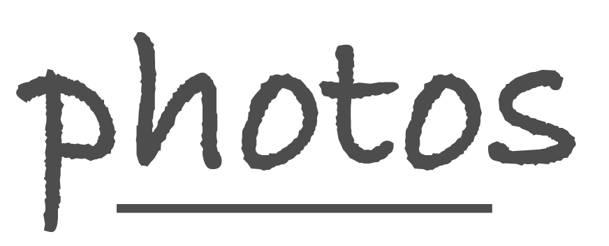

## [Y] やったこと

- Adobe Illustratorで見出しとロゴの画像を作ってみた
  - 
  - 
  - 
  - 
  - 
- [Unsplash](https://unsplash.com/)でいい感じの写真を眺めた
- [やってみたいこと](https://twitter.com/camomile_cafe/status/1353858315546030080)をツイートした
- 物理出社した
- MacのBig Sur環境で検証してみた
- CEOとご飯食べた

## [W] わかったこと

- Adobe Illustratorを初めてさわったのもあって、3時間で見出しとロゴの画像が作れた
  - 線を均等な間隔で開ける方法が分からず、目で見てなんとなく合わせた
  - ロゴや見出しの画像製作を短時間でできてしまう人はすごいなと感じた
- Unsplashで夜、カフェ、お茶などのキーワードで検索したらリラックスできそうな雰囲気の画像が多くヒットされた
  - 落ち着くというイメージとしてこういうキーワードもありだなと感じた
- [やってみたいこと](https://twitter.com/camomile_cafe/status/1353858315546030080)のツイートから知り合いのポジティブな反応がもらえた
  - 無論、お金のことだったり現実的な課題だったりも考えてすぐにできることではないけど、気になる人はある程度いることがわかった
  - 場所、どんなエンジニアが集まって欲しいのか、営業時間、マネタイズ、そもそも喫茶店にする必要はあるのかなどなど考える必要があることが多かった
    - カフェや喫茶店にする場合は営業許可を取る必要があることがわかった
  - とくに、コンセプトのきっかけとなったことにエンジニア界隈の属性を加えてできたことだったので、ターゲット層はそれでいいのかという面もある
  - Readyforとかmakuakeとかのサイトを見て、他の人が喫茶店を開くときにどのようにプロジェクトを立ち上げているのかを見ておく必要があると思った
- Big Surで動作検証してみて、ビルドが動いていることがわかった
  - 多分、rosetta2がうまく機能しているっぽい
- 次のタスクのことでちらっと話を聞いてみたら、モーダルの上にさらにモーダルを表示するみたいなことを想定してたらしい
  - モーダルは最大1回までにして、ほかのモーダルを表示したいのであれば、表示中のものを閉じてから表示させるように説得した
  - じゃないと画面が無限にできる仕様になりそうで今のうちに止めておいた

## [T] 次にやること

- 図書館で借りた本を読む（D-4）
- 本のサンプルコードからコードを書いてみる（D-4）
- 電子書籍を読む
- コード修正後、ビルドの検証をする
