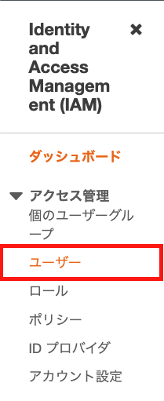

AWS を触る機会があり、初期設定を行おうとするにも、わからないことが多かった

AWS のアカウントを登録してから、最初にやっておくことについてまとめる

## admin ユーザーの作成

前提として、以下の作業は済ませているとする

- AWS のアカウントは作成済み
- ルートユーザーとしてログインしている

コンソール内で `IAM` を検索し、サービスを選択する


`IAM` に遷移したら、サイドバーの `アクセス管理 > ユーザー` を選択する



表示される画面から `ユーザーを追加` を選択し、登録画面に遷移する

### ユーザー詳細の設定

画面が切り替わったら、以下の項目に情報を記入する

- ユーザー名
  - 管理しやすい名前にする
- AWS 認証情報タイプの選択
  - `アクセスキー - プログラムによるアクセス` と `パスワード - AWS マネジメントコンソールへのアクセス` の両方にチェックを入れる
- コンソールのパスワード
  - やりやすい方を選ぶ
- パスワードのリセットが必要
  - チェックを外す


### アクセス許可の設定

画面が切り替わったら、 `アクセス許可の設定 > 既存のポリシーを直接アタッチ` を選択し、ポロシーの中から `AdministratorAccess` を選ぶ


### タグを追加

必要な場合は、ここで追加する


### 確認

入力した内容に問題ないかを確認し、 `ユーザーの作成` をクリックする


### アクセスキー、シークレットアクセスキーを控える

ユーザー作成が完了したら、完了ページから `アクセスキー` と `シークレットアクセスキー` を控えるか `csv` データとしてダウンロードしておく

`awscli` の認証情報と設定ファイルを作成するときに使う


## `awscli` の初期化

macOS の環境でインストールすることを想定する

### `awscli` のインストール

`brew` でコマンドをインストールする

```
$ brew install awscli

$ which aws
/usr/local/bin/aws

$ aws --version
aws-cli/2.2.43 Python/3.9.7 Darwin/19.6.0 source/x86_64 prompt/off
```

### `awscli` の設定

admin ユーザーの作成時に控えた `アクセスキー` と `シークレットアクセスキー` を使って、設定を行う

```
$ aws configure --profile 管理したいプロファイル名
AWS Access Key ID [None]: アクセスキー
AWS Secret Access Key [None]: シークレットアクセスキー
Default region name [None]: ap-northeast-1
Default output format [None]: json
```

### `awscli` の設定の確認

以下のコマンドで設定状況を確認ができる

```
$ aws --profile 設定したプロファイル名 configure list
      Name                    Value             Type    Location
      ----                    -----             ----    --------
   profile       設定したプロファイル名           manual    --profile
access_key     ****************XM7I shared-credentials-file
secret_key     ****************vIXj shared-credentials-file
    region           ap-northeast-1      config-file    ~/.aws/config
```

もしくは、以下のパスにあるファイルでも確認ができる

|         パス         |                        確認できること                         |
| :------------------: | :-----------------------------------------------------------: |
|   `~/.aws/config`    |    プロファイル毎の `フォーマット形式` と `リージョン情報`    |
| `~/.aws/credentials` | プロファイル毎の `アクセスキー` と `シークレットアクセスキー` |

## `AdministratorAccess` ユーザーで `awscli` から確認できること

`aws iam help` で[確認できることの一覧](https://gist.github.com/LeeDDHH/87a7b0c53e77d6dc10710ab1216d46bd)は表示される

## さいごに

`awscli` の設定時に、どんなポリシーを使えばいいのかわからず迷っていたが、これでローカル環境からアカウントで管理している `iam` の状況は確認できるようになった
