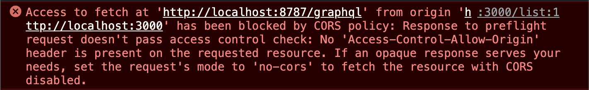
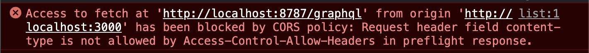

## はじめに

前回の記事の通り、 [個人的に作っていたプロジェクト](https://rod.expfrom.me/) のサーバ側を Cloudflare Workers に移行している

移行したのはいいものの、いざ本番にデプロイをしたら CORS 系のエラーが発生していて設定を追加するまで色々と調べて実装したので、今回はそのまとめをする

## CORS ミドルウェアを使う前のエラーと対応

まず、CORS 対応する前に起きていたエラーは以下の通りだった



訳すると、こんなことが書かれている

- `http://localhost:3000（フロント側）` から `http://localhost:8787/graphql（サーバ側）` で取得するアクセスが CORS ポリシーによってブロックされている
- `preflight` リクエストへの応答がアクセス制御チェックで通らない
- `Access-Control-Allow-Origin` ヘッダが存在しない
- CORS 対応しない場合は `no-cors` を設定する

今回対応したいのは `特定の許可されたオリジンからのリクエストにのみレスポンスを返す` ことだったので CORS 対応をする

どんなことをするかというと、HONO の Doc の [CORS Middleware](https://hono.dev/middleware/builtin/cors) をほぼそのまま対応する形になる

公式 Doc を参考に対応するコードは以下だった

```typescript
import { Hono } from 'hono'
import { cors } from 'hono/cors'
︙
app.use(
  '/graphql',
  cors({
    origin: ['https://rod.expfrom.me', 'http://localhost:3000'], // 本番と開発環境のURL
    allowHeaders: ['X-Custom-Header', 'Upgrade-Insecure-Requests'],
    allowMethods: ['POST', 'GET', 'OPTIONS'],
    exposeHeaders: ['Content-Length', 'X-Kuma-Revision'],
    maxAge: 600,
    credentials: true,
  })
)
︙
```

対応としては単純だけど、 CORS ミドルウェアを導入することで今回の対応は終わる…  
はずだったが、まだエラー解消されていない箇所があったため、さらに対応をする

## CORS ミドルウェアを使った後のエラーと対応

CORS ミドルウェアを導入したけど、どれでもエラーが発生していた



訳すると、こんなことが書かれている

- `http://localhost:3000（フロント側）` から `http://localhost:8787/graphql（サーバ側）` で取得するアクセスが CORS ポリシーによってブロックされている
- `preflight` リクエストへの応答がアクセス制御チェックで通らない

どうやら `preflight` は公式 Doc 通りの実装だけでは解決しないようだった

### preflight リクエストについて

[こちら](https://blog.foresta.me/posts/http_preflight_request/)のブログを見ると `preflight` リクエストがどんなことで、解決するためには何をしたらいいのかについて書かれていた  
また、[MDN の Doc](https://developer.mozilla.org/ja/docs/Glossary/Preflight_request) にも定義自体は書かれていた

そして、 `preflight` リクエストとは以下の条件で発生するものらしい

- CORS (Cross-Origin Resource Sharing) の中でブラウザが自動で飛ばすリクエスト
  - 特定の条件を満たすと Chrome の Network タブなどに OPTIONS という HTTP Method でリクエストが投げられていることが確認できる
- Web Server と API Server の Origin が違うような場合に発生する
- `単純リクエスト` と呼ばれるリクエスト `以外` の通信をおこなう際に，通信おこなう前にブラウザが自動で送信する

今回の場合、 `単純リクエスト` ではなかったため、 `preflight` が発生していた  
`単純リクエスト` の種類については以下のようだ

- GET, HEAD, POST メソッド
- 自動で付与されたヘッダー以外、特定のヘッダーのみが付与されている
  - Accept
  - Accept-Language
  - Content-Language
  - Content-Type
  - DPR
  - Downlink
  - Save-Data
  - Viewport-Width
  - Width
- Content-Type ヘッダーで特定の値のみが与えられている
  - application/x-www-form-urlencoded
  - multipart/form-data
  - text/plain

### preflight リクエストの対応

今回は、本番環境で POST メソッドで通信する際に、Content-Type を `application/json` にしてリクエストしていたことが原因だった  
そのため、 `単純リクエスト` に含まれず、 preflight リクエストが飛んでいた

解決方法としてリクエストのヘッダーに `Content-Type` を追加することで、 `単純リクエスト以外` の場合でも通信ができるようにした

`Content-Type` は[セーフリクエストヘッダー](https://developer.mozilla.org/ja/docs/Glossary/CORS-safelisted_request_header)として定義されているため、本来は `allowHeaders` に設定する必要はないが、 `application/json` にしてリクエストすることを許可するために設定する

HONO で書く場合はこのようになる

```typescript
import { Hono } from 'hono'
import { cors } from 'hono/cors'
︙
app.use(
  '/graphql',
  cors({
    origin: ['https://rod.expfrom.me', 'http://localhost:3000'],
    allowHeaders: ['X-Custom-Header', 'Upgrade-Insecure-Requests', 'Content-Type'], // ここに追加
    allowMethods: ['POST', 'GET', 'OPTIONS'],
    exposeHeaders: ['Content-Length', 'X-Kuma-Revision'],
    maxAge: 600,
    credentials: true,
  })
)
︙
```

これで、CORS エラーをすべて解決できた

## さいごに

CORS エラーが起きたとき、最初は戸惑っていたが、 HONO 側で対応するためのミドルウェアを提供してくれていて安心していた  
しかし、 `preflight` リクエストという条件については今回初めて出くわしたこともあり、勉強になった

## 参考文献

- [CORS Middleware - Hono](https://hono.dev/middleware/builtin/cors)
- [CORS Policy 違反と，Preflight request (OPTIONS) について](https://blog.foresta.me/posts/http_preflight_request/)
- [Preflight request (プリフライトリクエスト) - MDN Web Docs 用語集: ウェブ関連用語の定義 | MDN](https://developer.mozilla.org/ja/docs/Glossary/Preflight_request)
- [CORS-safelisted request header (CORS セーフリストリクエストヘッダー) - MDN Web Docs 用語集: ウェブ関連用語の定義 | MDN](https://developer.mozilla.org/ja/docs/Glossary/CORS-safelisted_request_header)
