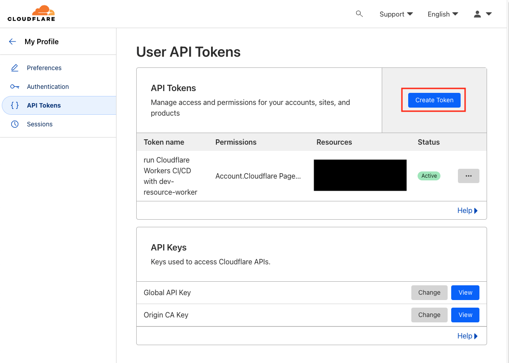

## はじめに

個人的に作っていたプロジェクトの [ResourceOfDevelop](https://rod.expfrom.me/) を Cloudflare に移行した際に Graphql のサーバを Cloudflare Worker に移行した

これまで自分の PC から [wrangler](https://github.com/cloudflare/workers-sdk) を使ってデプロイしていたが、「main ブランチにコミットしたら、そのままデプロイしてくれると便利だろうに」と思った

GitHub にコミットをしたら、 GitHub Actions 経由で Cloudflare Worker にデプロイするための設定を一通りやってみたので、今回はそのまとめをする

## Cloudflare 側の設定

まず、Cloudflare 側で外部サービスと連携して使うための API Token を発行する

Cloudflare Workers にプロジェクトを公開していることを前提に以下の手順ですすめる

- マイページの [API Tokens](https://dash.cloudflare.com/profile/api-tokens) に遷移し、「Create Token」をクリックする

- Cloud Workers のテンプレートを使うため、「Edit Cloudflare Workers」をクリックする

- API Token を設定するページに遷移したら、どのプロジェクトで使う Token なのか説明を書く

- 「Account Resources」にログインしたアカウントを選択する

- 「Zone Resources」で以下を選択する
  - 「All zones from an account」
  - ログインしたアカウント

- 追加で設定しておきたい項目があれば選択をして、「Continue to summary」をクリックする

- API Token を生成する前に権限まわりで問題がないか確認をして、「Create Token」をクリックする

- 生成した Token のコピーする
  - この Token の値を GitHub の CI/CD 設定時に使う
  - **※ API Token を生成して別の画面に遷移すると、再び確認することができないので、必ずメモをとっておく**

ここまで進んだら、Cloudflare 側でやることは一通り終わったので、あとは GitHub 側で CI/CD の設定をする

## GitHub 側の設定

GitHub 側は CI/CD 用の workflows を生成して、リポジトリの Secrets に API Token を設定すれば、Cloudflare Workers にデプロイできる状態になる

- [wrangler-action](https://github.com/cloudflare/wrangler-action#usage)の設定例を参考にして workflows に設定をする
  - `main` ブランチに push されたらデプロイが走るように設定している
  - `secrets.CF_API_TOKEN` はリポジトリの Secrets で設定ができる

- リポジトリの `Settings > Secrets and variables > Actions` に遷移し、「New repository secret」をクリックする

- Secret として以下を設定し、「Add Secret」をクリックする
  - Name
    - `CF_API_TOKEN`
  - Secret
    - Cloudflare 側でコピーした Token を貼り付ける

ここまで進むと `main` ブランチにコードを push するたびに Cloudflare Workers 側にデプロイが走る

詳しくはリポジトリの「Actions」から確認ができる

## さいごに

Cloudflare 側の公式の[ドキュメント](https://developers.cloudflare.com/fundamentals/api/get-started/create-token/)があったり、GitHub 側で設定する方法を紹介した[ブログ](https://rest-term.com/archives/3611/)があったりしたが、両方の設定を手順として一つの記事にまとめたものが見当たらなかったのもあり、今回はそういう手順をまとめてみた

書いてみたら簡単だったが一連の手順としてまとめられてスッキリした
