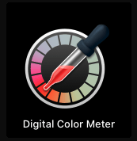
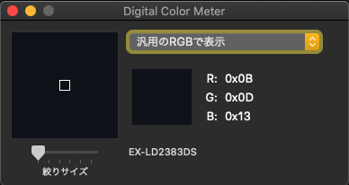
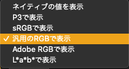
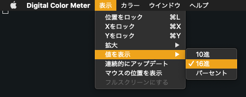
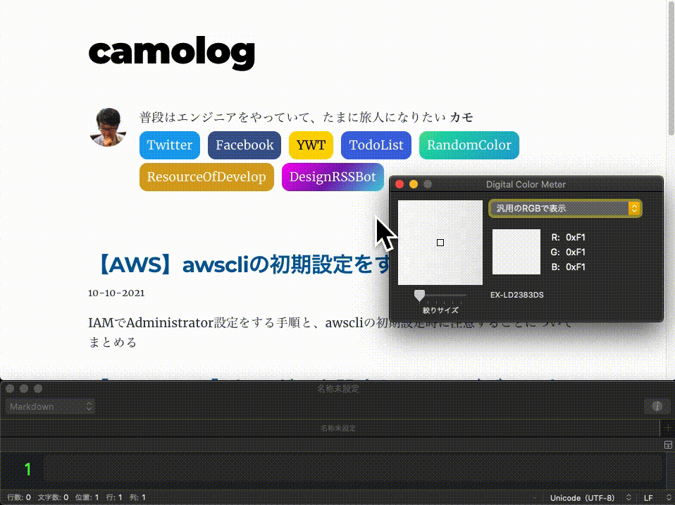

画面に表示されている色をカラーコードとして取得するためにカラーピッカー用のアプリをインストールして使っていたが、Mac のデフォルトアプリだけで十分取得できた

今回は、その方法についてまとめる

## `Digital Color Meter` を起動する

Mac にはデフォルトでインストールされた `Digital Color Meter` というアプリがある

このアプリを起動すると、以下のような UI が表示される

基本的な使い方は、画面に表示されているピクセルにマウスのカーソルを当てることで、その色情報が確認できる

## HEX 値として取得するための設定をする

今回は、色情報を HEX 値として取得することが目的なので、アプリ内で以下の設定をする

まず、画面上でやることは、プルダウン式のオプションから `汎用のRGBで表示` を選択する

次に、メニューバーの `表示 > 値を表示 > 16進` を選択する

これで HEX 値を取得する準備は完了になる

## 取得後、確認する

上記の準備ができたら、取得したい色のピクセルにカーソルを当てて、 `Command + Shift + C` を入力することでその色の HEX 値が取得できる

以下は、[このブログ](https://expfrom.me/)のバッジにある色の HEX 値を取得するときの例になる

  

このようにカラーコードでも使う HEX 値が取得できる

## さいごに

ブラウザとか単体のアプリとかでカラーピッカーを選ぶのに悩むことがあるけど、シンプルに HEX 値を取るだけならこの方法で十分だと思った
