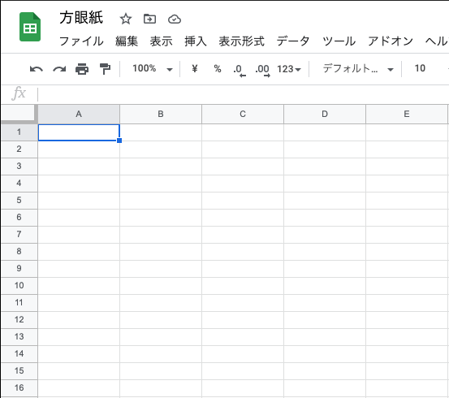
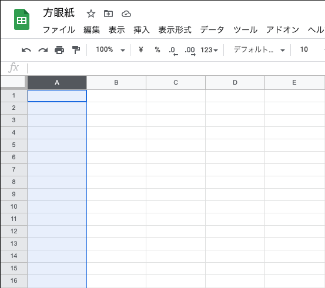
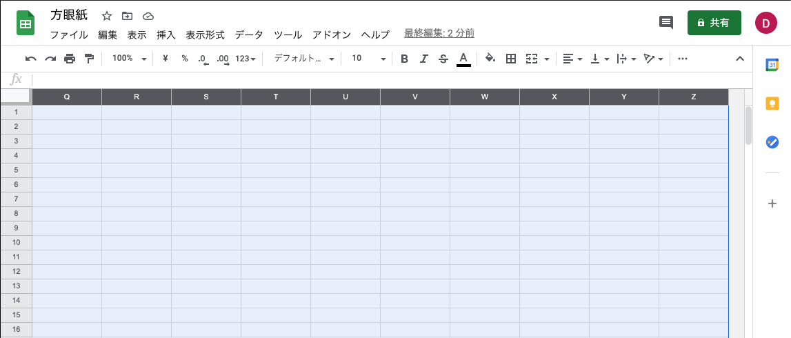
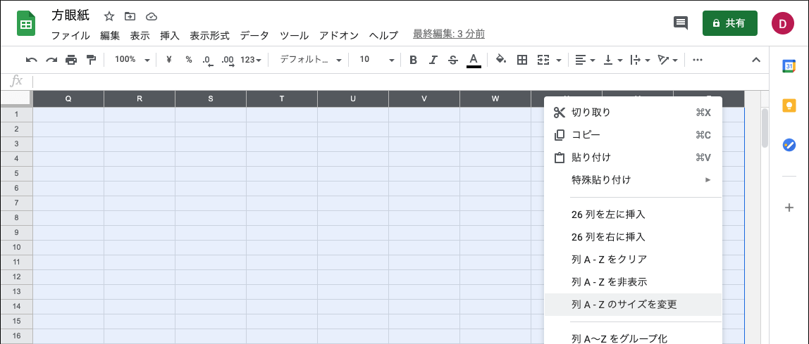
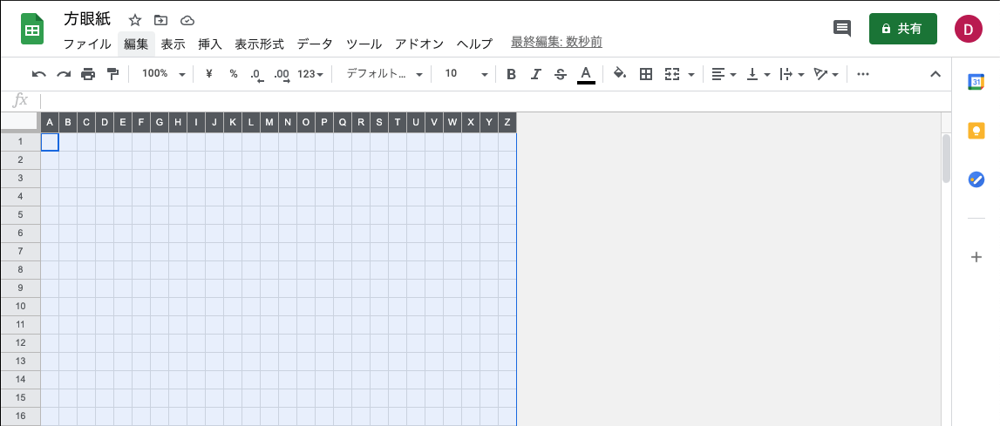
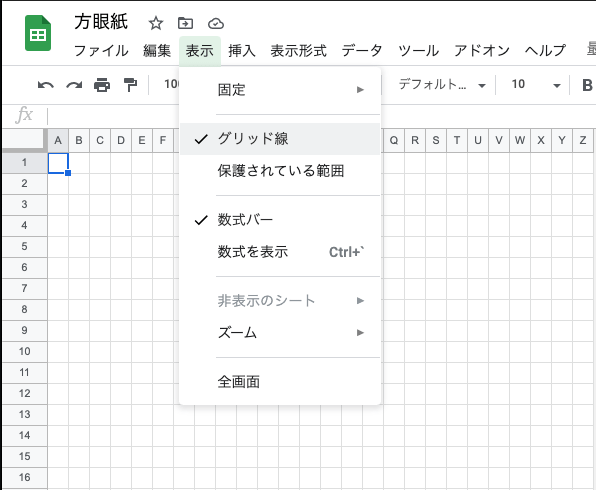
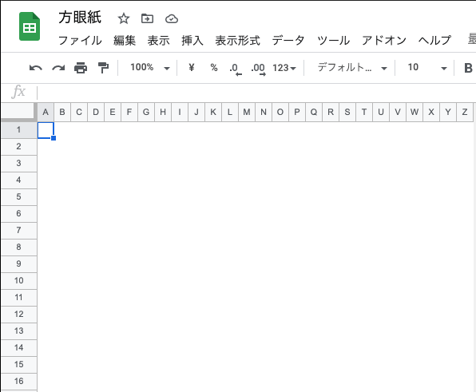

マス目のワイヤーフレームが必要になり、Mac 版の Spreadsheet で方眼紙を作ってみた

## やったこと

方眼紙にするために以下のことをやった

- 全列選択する
- 列のサイズを均一に変更する

### 全列選択する

A 列 1 行目を選択する

`ctrl + space` で現在の列を選択する

`Shift + Command + →` で最後の列まで選択する

これでシートの全列を選択した状態になる

### 列のサイズを均一に変更する

全列選択をした状態で任意の列を右クリックし、`列のサイズを変更` を選択する

サイズを `20` にする

これでマス目の均一なシートができ上がった

## おまけ

セルの枠線を非表示にすることでシートをスッキリする方法もあったので、操作方法を残す

メニューの `表示 > グリッド線` をクリックして無効にする

セルの枠線が非表示になる

