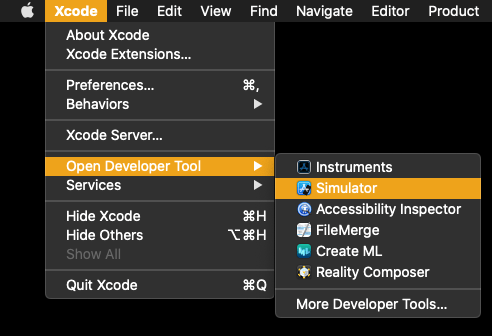

React Nativeプロジェクトを触る機会があり、プロジェクトをwebで確認することはできたものの、iOS端末がないため、実機での確認ができなかった

そのため、Expoを起動したプロジェクトにMacのiOS Simulatorを使って確認するための方法についてまとめる

## Expoを起動する

前提として、以下の作業は済ませているとする

- `Xcode` と `Xcode Command Line Tools` はインストールされている
- `expo` が起動できる `React Native` のプロジェクトがローカルにある

まず、 `expo` でプロジェクトを起動する

`expo start`

すると以下のように、起動している `expo` からQRコードを読み込んでスマホからでも確認ができるような状態となる

## iOS Simulatorを起動する

ただ、この状態で `Press i │ open iOS simulator` にしたがって、 `i` を押してもシミュレーターは起動しない

そこで、手動でシミュレーターを起動させる必要がある

`Xcode` を開き、メニューバーの `Xcode > Open Developer Tool > Simulator` をクリックする

`iOS Simulator` が起動し、以下のような画面が表示される

ここでは、 `iPhone 12 Pro Max` が選択されているが、他のデバイスで確認をしたい場合は、メニューバーの `File > Open Simulator > iOS` から選べる

## ExpoのプロジェクトをiOS Simulatorで起動する

上記の準備ができたら、あとはターミナルから `i` を押して、起動している `iOS Simulator` から `expo` のプロジェクトを起動する

`iOS Simulator` で `expo` プロジェクトを初めて起動した場合、以下のような画面が出るので `Open` をする

起動時に問題がなければ、アプリケーションの画面が表示される  
※以下は、起動した時「HomeScreen」と表示されるよう、あらかじめ設定された画面になる

## おまけ

`expo` プロジェクト起動時に、最初から `iOS Simulator` を起動させたい場合は `package.json` の `scripts` にシミュレーターをあらかじめ設定しておくこともできる

まず、ローカルで起動できる `iOS Simulator` の確認が必要になる

そのためのコマンドは、以下になる

`xcrun simctl list devices`

使用可能なシミュレーターがある場合、以下のような表示になる

`Devices` 以下の `Unavailable` までのデバイスが使用可能なシミュレーターになるため、この中から選ぶ

試しに、 `iPhone SE` デバイスを起動する場合は、以下のコマンドになる

`npm run ios --simulator="iPhone SE"`

コマンドを実行すると、以下のように `expo` プロジェクトが起動された後、 `iPhone SE` のシミュレーターが起動する

  

## 最後に

ちょうどAndroidのスマホしか持っていなかったため、iOS系のデバイスでの確認ができず、困っていたが、これで確認ができるようになってよかった
