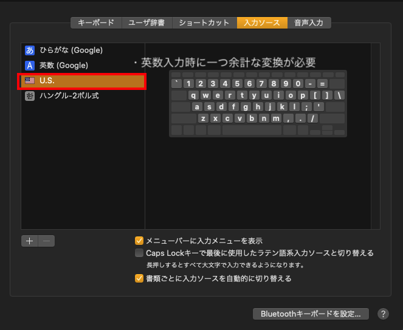
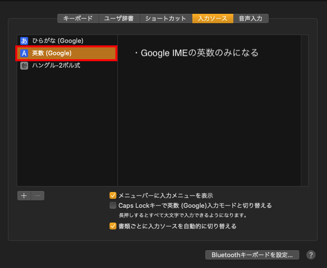
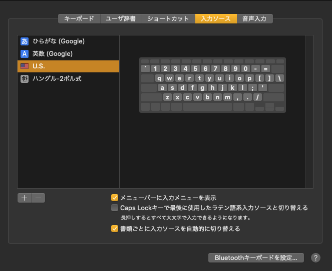
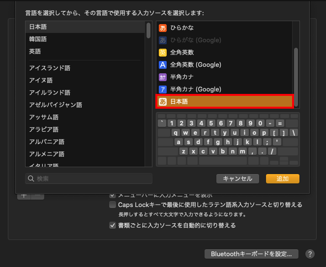
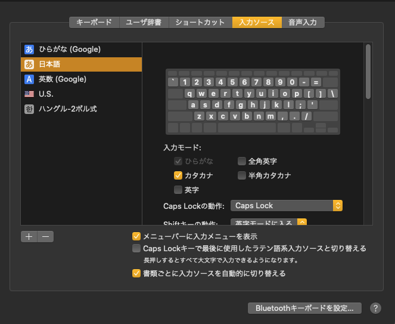
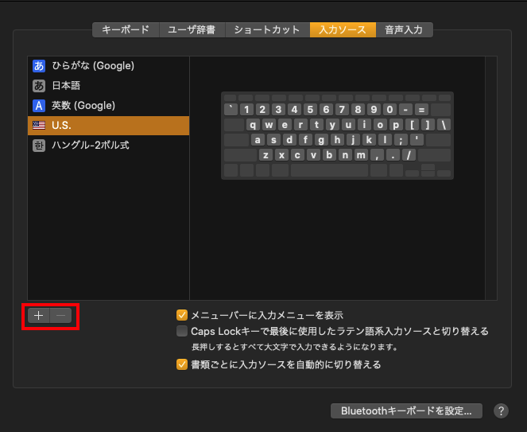
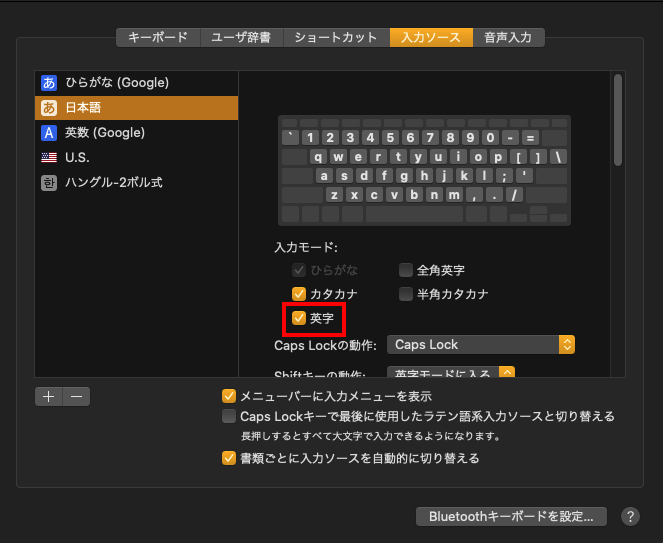
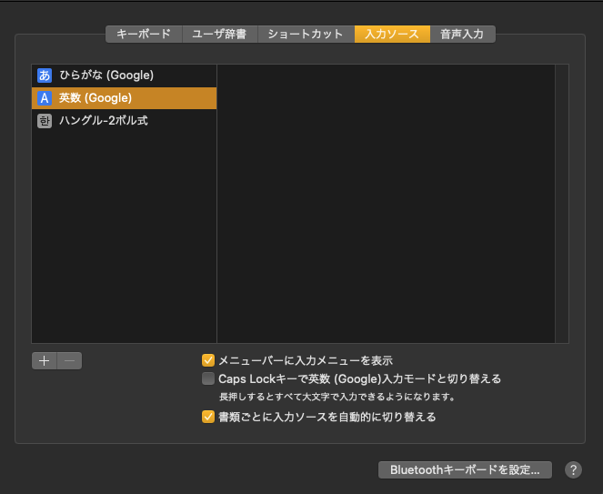

[karabiner-elements](https://karabiner-elements.pqrs.org/)で複数の入力ソースを切り替えながら使っていたが、余計な入力ソースがあることで変換時にキーを押す回数が常に 1 回多くなっていた

それで、Mac の英語の入力ソースとして US が除外できなくそのまま使っていたが、ある方法を使うと入力ソースから除外ができて Google IME の英数が使えるようになった

今回は、その方法についてまとめる

## 入力ソースに日本語を追加する

まずは、 `システム環境設定 > キーボード > 入力ソース` にアクセスする

「+」ボタンから `日本語 > 日本語` を追加する

US 入力ソースを除外するのにいきなり日本語を入力するということで戸惑うかもしれないが、**日本語の入力ソースで US 入力ソースを排除する設定**があるため、追加する必要がある

## 日本語と英数の入力を Google IME だけにする

日本語の入力ソースを追加するとこのような状態になる

しかし、この状態ではまだ US の入力ソースが除外できない

そこで、日本語入力ソースの `入力モード > 英字` にチェックを入れる

すると、以下のように US の入力ソースが除外できる状態になる

おそらく、Mac はなにかしたら英字入力ができる状態ではないと US の入力ソースが除外できない  
そして、この状態で `U.S.` と `日本語` を除外すると以下のように Google IME のみでひらがなと英数が入力できる状態になる

なお、この状態だと Google IME の英数が除外できない状態になる  
除外したい場合は、英字の入力ソースを追加してから試す必要がある

## さいごに

Mac の環境で Google IME のみの状態で日本語と英数の入力ソースを利用したかったのが、やっとかなえてよかった
