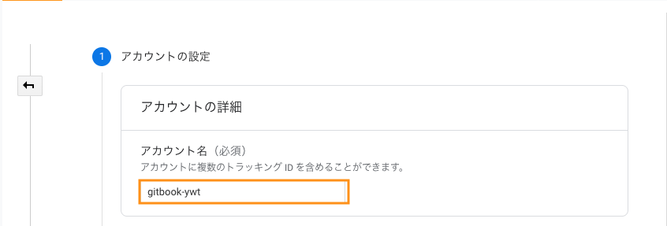

[YWTページ](https://ywt.expfrom.me/)のビュー数を計測するため、Google Analyticsで新しくアカウントを作ったが、UAのトラッキングIDを閲覧するためのプロパティが生成されず、困っていた

どうやら、[2020年10月14日以降にGoogle Analyticsを設定すると「Google Analytics 4」というプロパティが作られる](https://support.google.com/analytics/answer/10220206)みたいで、以前まで覚えていた手順ではUAのトラッキングIDが取得できなかった

Google Analytics 4の仕様が加わり、新しくなったGoogle AnalyticsでUAのトラッキングIDを確認するまでの手順をまとめる

## アカウントとプロパティの作成

まず、[Google Analytics](https://analytics.google.com/analytics/web/)のページに遷移し、サインインする

画面が変わったら、 `⚙ > アカウント作成` をクリックする

アカウント作成ページに遷移したら、アカウント名を決める

次に、プロパティの詳細を設定する  
ここではプロパティ名、Google Analyticsで取得した情報をレポートしてくれるタイムゾーンなどが指定できる

この時点で、基本的にはGoogle Analytics 4のみ生成する  
なので、追加でUA（ユニバーサルアナリティクス）も生成するために「**詳細オプションを表示**」をクリックする

詳細画面でUAを使うウェブサイトのURLを書き込み、プロパティを生成するオプションが選択できる

選択肢としては、「UAのみ生成」と「Google Analytics 4とUAを生成」がある  
ここでUAのみを選択してもいいが、今後UAが廃止されたりGoogle Analytics 4の機能が強化されたりする可能性があるため、両方とも生成するように選ぶ

設定が終わったら、**次へ**をクリックする

ビジネス情報とGoogle Analytics利用規約などをひととおり記入し、設定を終えると指定したアカウント名/プロパティ名（Google Analytics 4）が選ばれた状態になる

UAのプロパティをみるために、**すべてのアカウント**から**設定したアカウント名/UAのプロパティ**のビューを選択する

## トラッキングIDを確認する

UAプロパティに切り替わったら、 `⚙ > 管理 > トラッキング情報 > トラッキングコード` の順で項目をクリックする

プロパティの詳細画面に切り替わり、トラッキング情報が表示される

オレンジの枠に書かれているのが**トラッキングID**である

一般的なHTMLのページであれば、**グローバル サイトタグ**のスクリプトをコピーして**head**タグに貼り付ければ動作するだろう

## さいごに

GTMのときと同様、[Gatsby.JS](https://www.gatsbyjs.com/)とか[Hugo](https://gohugo.io/)とかのようなフレームワークを使う場合は、別途ライブラリを使う可能性があるので、公式ページから探してみるほうがいいと思った
