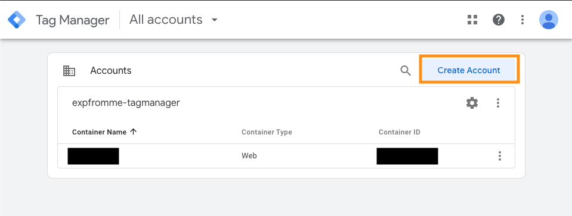
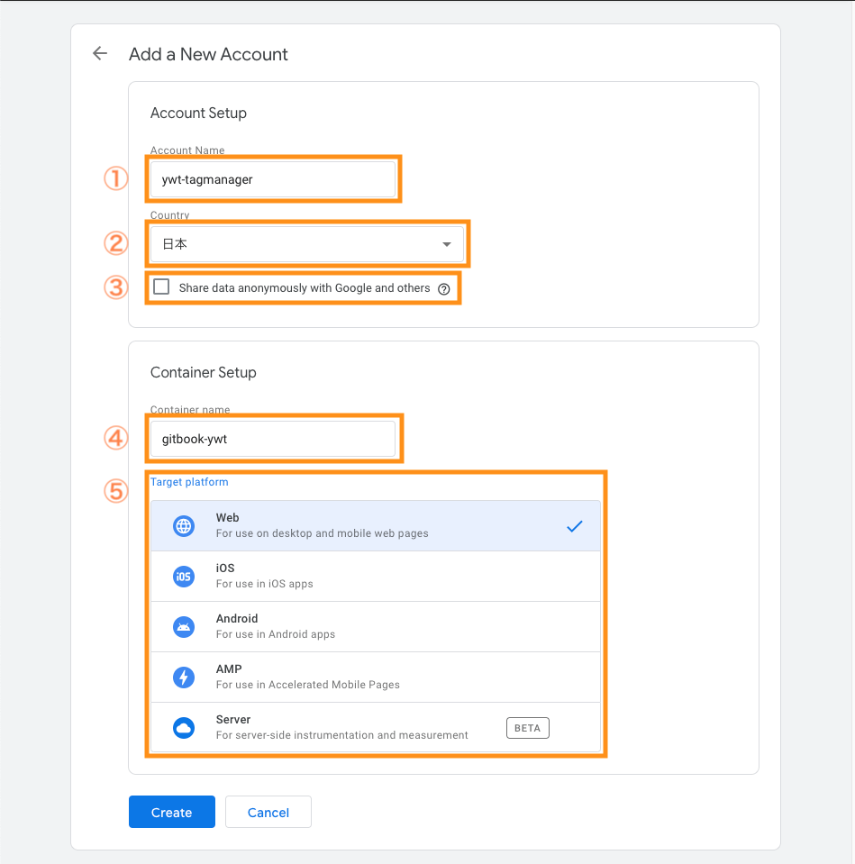
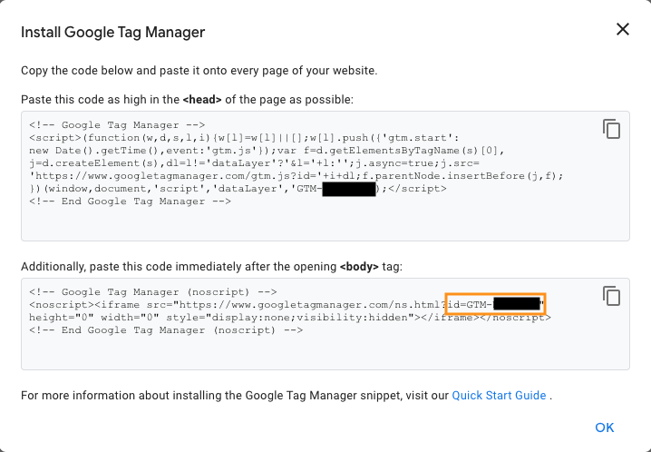
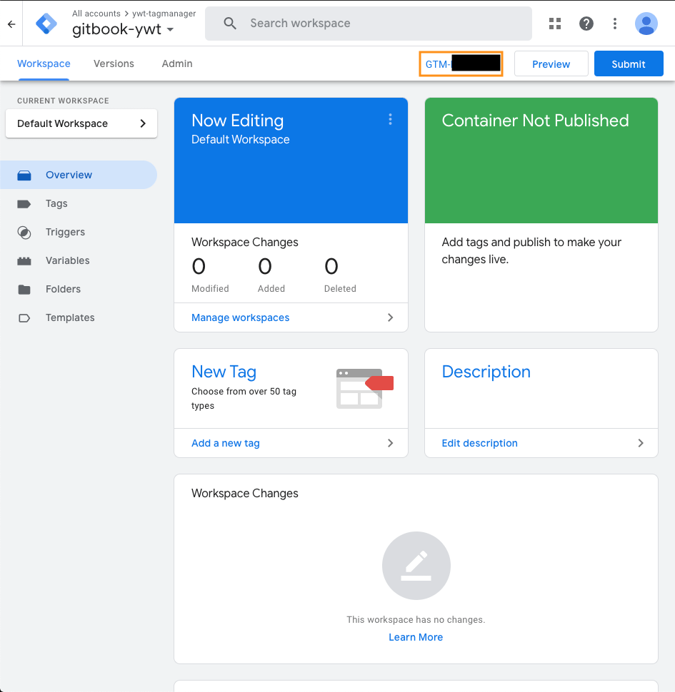

何年か前に Google Tag Manager を触ってた時の UI のまま覚えていて手順でコンテナーを作ろうとしたが、すっかり変わってしまった

新しくなった UI でコンテナー作成とコンテナーの ID を確認する方法がわかったので、その手順をまとめる

## コンテナーの作成

まず、[Google Tag Manager](https://marketingplatform.google.com/about/tag-manager/)のページに遷移し、サインインする

表示される画面の**Create Account**をクリックする

アカウントは、基本的に 1 つあればそのアカウント内で複数のコンテナーが作れる  
コンテナーに関しては後述する

アカウント作成ページでは以下の 5 つの項目を埋める

1. ユーザーが識別するための**アカウント名**
2. アカウントを所有する組織の**国**
3. **Google に匿名でデータの共有**を有効/無効にする
4. **コンテナーの名前**
5. コンテナーのの**プラットフォーム**の種類

コンテナーとは、特定の目的を持つ複数のタグを一元管理するための仕組みの単位を指す  
ウェブサイトで取得したタグであれば**Web**を選択し、アプリケーションでの挙動でタグを取得したいのであれば、**iOS**、**Android**を選択する

選択が終わったら、**Create**をクリックする

## コンテナー ID を確認する

コンテナーを生成すると、最初に Google Tag Manager で使うための ID を表示してくれる

オレンジの枠に書かれている**GTM-**からはじまる文字列が、よく**GTM の ID**、**GTM コンテナーの ID**と呼ばれる ID である

一般的な HTML のページであれば、スクリプトをコピーして**head**タグに貼り付ければ動作するだろう

OK ボタンをクリックすると、以下の画面が表示される

もし、再度**GTM の ID**を確認したいのであれば、このページのオレンジの枠で囲ったところをクリックすると、表示してくれる

## さいごに

[Gatsby.JS](https://www.gatsbyjs.com/)とか[Hugo](https://gohugo.io/)とかのようなフレームワークを使う場合は、別途ライブラリを使う可能性があるので、公式ページから探してみるほうがいいと思った
