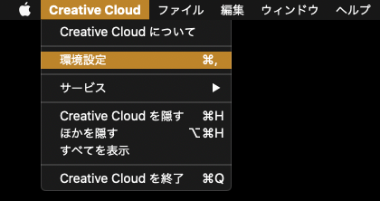
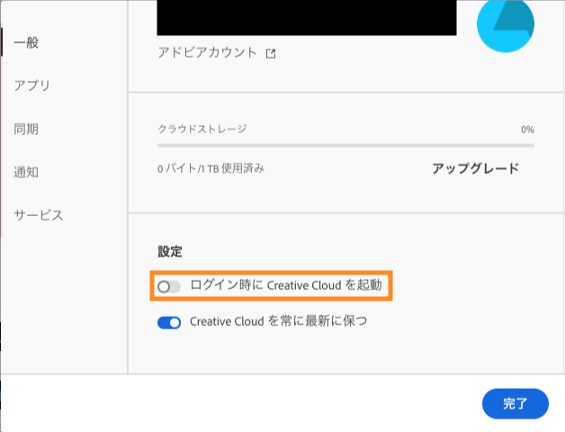

Mac を起動するたびに、[Adobe Creative Cloud](https://www.adobe.com/jp/creativecloud.html)が自動起動されて、煩わしかった

## 問題

`システム環境設定 > ユーザーとグループ > ログイン項目` に[Adobe Creative Cloud](https://www.adobe.com/jp/creativecloud.html)がログイン時の自動起動項目に入っていなかったため、調査をしてみた

## 解決

1. メニューバーの `Creative Cloud > 環境設定` を開く

2. `ログイン時に Creative Cloud を起動` を `Off` にする

---

これで Mac を起動するたびに自動起動されることはない
