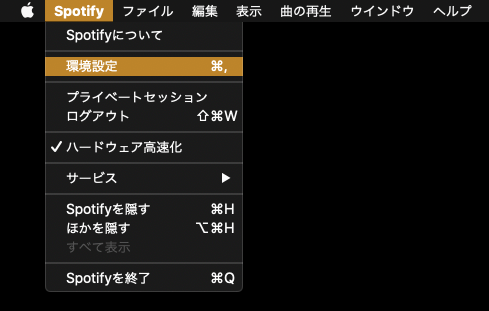
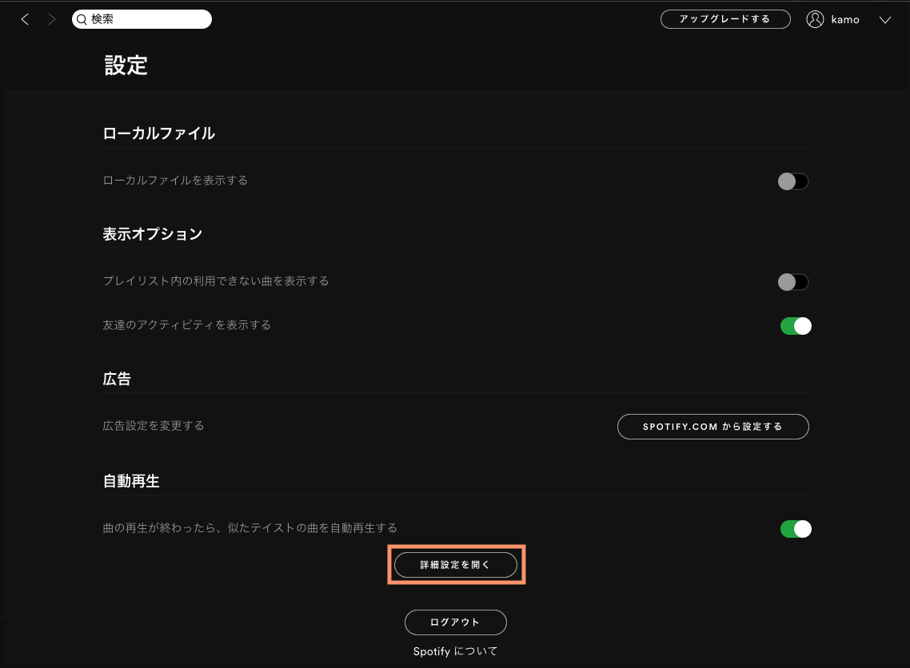
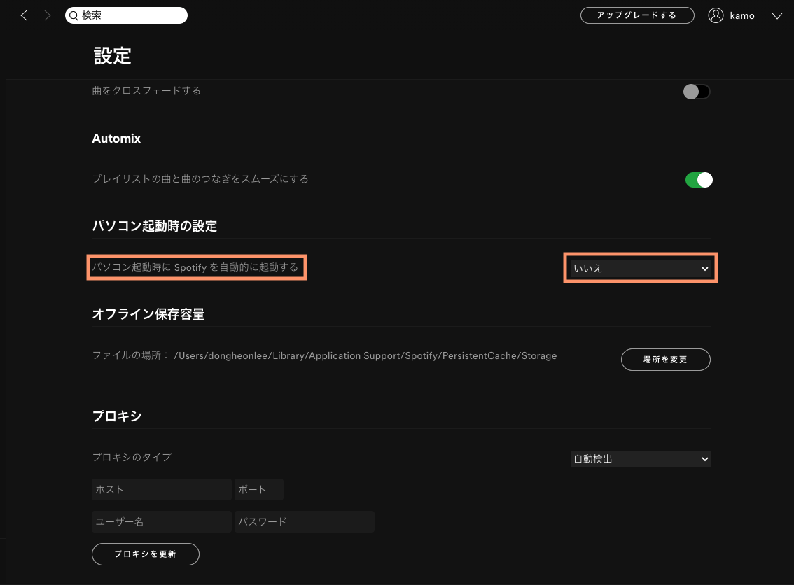

Macを起動するたびに、デスクトップ版の[Spotify](https://www.spotify.com/jp/)が自動起動されて、煩わしかった

## 問題

`システム環境設定 > ユーザーとグループ > ログイン項目` に[Spotify](https://www.spotify.com/jp/)がログイン時の自動起動項目に入っていなかったため、調査をしてみた

## 解決

1. メニューバーの `Spotify > 環境設定` を開く

2. 設定画面の一番下に `詳細設定を開く` をクリックする

3. `パソコン起動時に Spotify を自動的に起動する` を `いいえ` にする 

---

これでMacを起動するたびに自動起動されることはない
